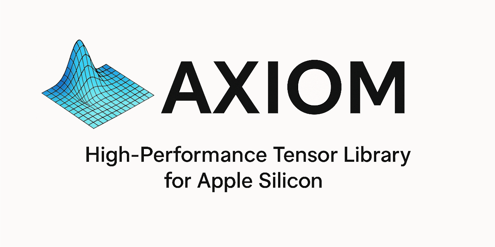

A state-of-the-art C++ tensor library optimized for Apple Silicon, providing full NumPy syntax compatibility and einops-style tensor rearrangement for seamless on-device AI inference.

## Features
- 🚀 Apple Silicon Optimized - Leverages Metal Performance Shaders and ARM NEON vectorization
- 🐍 NumPy Compatible - Full syntax compatibility for easy Python-to-C++ translation
- 🔄 Einops Support - Intuitive tensor rearrangement with einops-style operations
- 📊 ONNX Ready - Seamless integration with ONNX model inference pipelines
- ⚡ Zero-Copy Operations - Memory-efficient tensor operations where possible
- 🎯 Type Safety - Modern C++20 with compile-time shape checking

## Quick Start
### Prerequisites
- macOS 11.0+ (Big Sur) with Apple Silicon
- Xcode 13+ or Clang 13+
- CMake 3.20+
- Metal Performance Shaders Framework

## Build Instructions
```bash
# Clone the repository
git clone https://github.com/your-username/axiom.git
cd axiom

# Create build directory
mkdir build && cd build

# Configure with CMake
cmake .. -DCMAKE_BUILD_TYPE=Release -DAXIOM_BUILD_TESTS=ON

# Build
make -j$(sysctl -n hw.ncpu)

# Run tests
make test
```

## Installation
```cmake
# Install system-wide
sudo make install

# Or use in your CMake project
find_package(Axiom REQUIRED)
target_link_libraries(your_target Axiom::axiom)
```

## Usage Example
```cpp
#include <axiom/tensor.hpp>
#include <axiom/ops.hpp>

using namespace axiom;

int main() {
    // Create tensors with NumPy-like syntax
    auto x = tensor::randn({64, 128, 256});
    auto y = tensor::ones({256, 512});
    
    // Matrix operations
    auto result = x.matmul(y);
    
    // Einops-style rearrangement
    auto reshaped = x.rearrange("b h w -> b (h w)");
    
    // Broadcasting and element-wise ops
    auto scaled = (x * 2.0f + 1.0f).relu();
    
    return 0;
}
```

## Development Roadmap
### Phase 1: Core Foundation

- [x] Basic tensor class with shape/stride handling
- [x] Memory management and storage abstraction
- [x] CMake build system setup
- [ ] Basic arithmetic operations (+, -, *, /)

### Phase 2: Operations & Backends

- [ ] Metal backend implementation
- [ ] Linear algebra operations (matmul, dot, etc.)
- [ ] Reduction operations (sum, mean, max, etc.)
- [ ] Broadcasting semantics

### Phase 3: Advanced Features

- [ ] Einops-style rearrangement parser
- [ ] NumPy compatibility layer
- [ ] Automatic differentiation (optional)
- [ ] ONNX integration utilities

### Phase 4: Optimization

- [ ] Memory pool allocation
- [ ] Kernel fusion optimizations
- [ ] Multi-threading for CPU operations
- [ ] Benchmarking and profiling tools

## Performance Goals

- Memory Bandwidth: >90% of theoretical peak on Apple Silicon
- Compute Utilization: >85% GPU utilization for large tensor operations
- Latency: <1ms overhead for tensor creation and basic operations
- Compatibility: 100% pass rate on NumPy compatibility test suite

## License
MIT License - see [LICENSE](LICENSE) file for details.

## Citation
```bibtex
@misc{axiom2025,
  title={Axiom: High-Performance Tensor Library for Apple Silicon},
  author={Noah Kay},
  year={2025},
  url={https://github.com/frikallo/axiom}
}
```