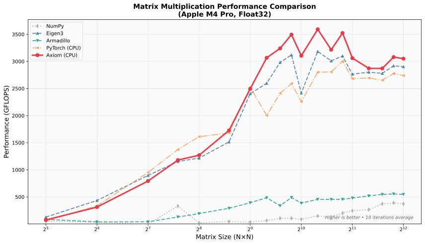

# Axiom


**Axiom** is an open-source, high-performance C++ tensor library that brings NumPy and PyTorch simplicity to native code.

[](https://github.com/frikallo/axiom/actions/workflows/ci-macos.yml)
[](https://github.com/frikallo/axiom/actions/workflows/ci-linux.yml)
[](https://github.com/frikallo/axiom/actions/workflows/ci-windows.yml)
[](https://github.com/frikallo/axiom/actions/workflows/ci-code-quality.yml)
[](https://opensource.org/licenses/MIT)
[](https://en.cppreference.com/w/cpp/20)

The **Axiom** library offers ...

  * ... **Python-familiar API**: Axiom's C++ API closely follows NumPy and PyTorch. Operator overloading, method chaining, and identical function names mean that if you know NumPy or PyTorch, you already know Axiom.

  * ... **Lazy computation**: Computations in Axiom are lazy. Operations build a computation graph and are only materialized when needed. The graph compiler automatically fuses operations and reuses buffers for maximum throughput.

  * ... **Multi-device**: Operations can run on any supported device — currently CPU and Metal GPU, with more coming soon 🤫. Every operation, not just matmul, runs on GPU with the same API.

  * ... **Unified memory**: On Apple Silicon, CPU and GPU tensors share the same physical memory. Switching between `.cpu()` and `.gpu()` is a zero-copy device-tag change — no `memcpy`, no latency.

  * ... **High performance**: SIMD vectorization, BLAS acceleration, and aggresive parallelization.

  * ... **Cross-platform**: macOS, Linux, and Windows.

Axiom is designed for researchers and engineers who need NumPy-level ergonomics with native performance. Learn more in the [documentation](https://axiom-cpp.readthedocs.io), or see the [Usage Guide](https://axiom-cpp.readthedocs.io/en/latest/usage.html) for a comprehensive API showcase.

----

## Why Axiom?

### Axiom is intuitive.

```cpp
// NumPy: x = np.where(x > 0, x, 0)
auto x = Tensor::where(x > 0, x, 0);

// NumPy: y = x.reshape(2, -1).T
auto y = x.reshape({2, -1}).T();

// PyTorch: z = F.softmax(scores, dim=-1)
auto z = scores.softmax(-1);
```

</td>
<td width="50%">

### Axiom is fast.



**3500+ GFLOPS** on M4 Pro. Beats Eigen & PyTorch.
See [docs/BENCHMARKS.md](docs/BENCHMARKS.md) for full results.

### Axiom is expressive.

```cpp
// Masking — just like NumPy
auto clamped = x.where(x > 0, 0.0f);

// Broadcasting
auto grid = col_vec + row_vec;  // {3,1} + {1,4} → {3,4}

// Zero-copy slicing
auto patch = image[{Slice(0,64), Slice(0,64)}];

// Einops
auto nchw = img.rearrange("b h w c -> b c h w");
auto pooled = x.reduce("b h w c -> b c", "mean");
```

Complex transformations, readable code.

</td>
<td>

### Axiom is reliable.

- **Comprehensive test suites** covering all operations
- **CI/CD pipeline** testing CPU and GPU paths
- **Cross-platform validation** on macOS, Linux, Windows
- **NaN/Inf guards** and **shape assertions** catch errors early.
- **Deterministic behavior** across platforms and runs.

Production-ready from day one.

</td>
</tr>
</table>

----

## Download

```bash
git clone https://github.com/frikallo/axiom.git
cd axiom && make release
```

Or fetch directly in CMake:

```cmake
include(FetchContent)
FetchContent_Declare(axiom
    GIT_REPOSITORY https://github.com/frikallo/axiom.git
    GIT_TAG main)
FetchContent_MakeAvailable(axiom)
target_link_libraries(your_target Axiom::axiom)
```

----

## Quick Start

```cpp
#include <axiom/axiom.hpp>
using namespace axiom;

int main() {
    // Create tensors — just like NumPy
    auto a = Tensor::randn({3, 4});
    auto b = Tensor::ones({4, 5});

    // Chain operations fluently
    auto result = (a.relu() + 1.0f).matmul(b).softmax(-1);

    // Lazy by default — nothing executes until needed
    auto c = ops::add(a, a);           // Deferred
    auto d = ops::relu(c);             // Still deferred
    float val = d.item<float>({0, 0}); // NOW it runs

    // Zero-copy slicing
    auto row = a[{0}];
    auto block = a.slice({Slice(0, 2), Slice(1, 3)});

    // Masking
    auto positive = a.where(a > 0, 0.0f);

    // Einops
    auto img = Tensor::randn({2, 224, 224, 3});
    auto nchw = img.rearrange("b h w c -> b c h w");

    // Linear algebra
    auto [U, S, Vt] = linalg::svd(a);

    return 0;
}
```

**GPU acceleration? Just change the device.** Every operation runs on Metal—no code changes required:

```cpp
// CPU version
auto x = Tensor::randn({1024, 1024}, DType::Float32, Device::CPU);

// GPU version - same API, 10-20x faster on Apple Silicon
auto x = Tensor::randn({1024, 1024}, DType::Float32, Device::GPU);

// Everything just works: matmul, softmax, reductions, broadcasting, indexing...
auto result = x.matmul(x.T()).softmax(-1).sum({1});  // All on GPU

// On Apple Silicon, device transfers are zero-copy — no memcpy overhead
auto cpu_result = result.cpu();  // Instant: same underlying memory
```

No other C++ tensor library offers this. Eigen, Armadillo, Blaze—all CPU-only. With Axiom, you get the same clean API with full GPU acceleration on macOS.

----

## Building from Source

```bash
# Clone
git clone https://github.com/frikallo/axiom.git
cd axiom

# Build (release mode)
make release

# Run tests
make test

# Install system-wide
sudo cmake --install build

# Optional: Build with OpenMP
cmake -B build -DCMAKE_BUILD_TYPE=Release -DAXIOM_USE_OPENMP=ON
cmake --build build
```

## Contributing

Contributions are welcome! Please ensure:

1. Code follows the project style (`make format`)
2. All tests pass (`make test`)
3. New features include tests
4. Documentation is updated

See [CONTRIBUTING.md](CONTRIBUTING.md) for detailed guidelines.

----

## License

Axiom is licensed under the **MIT License**. You are free to use, modify, and distribute Axiom in both open-source and proprietary projects.

See [LICENSE](LICENSE) for the full license text.

----

## Citation

If Axiom is useful in your research, please cite:

```bibtex
@misc{axiom2025,
  title={Axiom: High-Performance Tensor Library for C++},
  author={Noah Kay},
  year={2025},
  url={https://github.com/frikallo/axiom}
}
```
