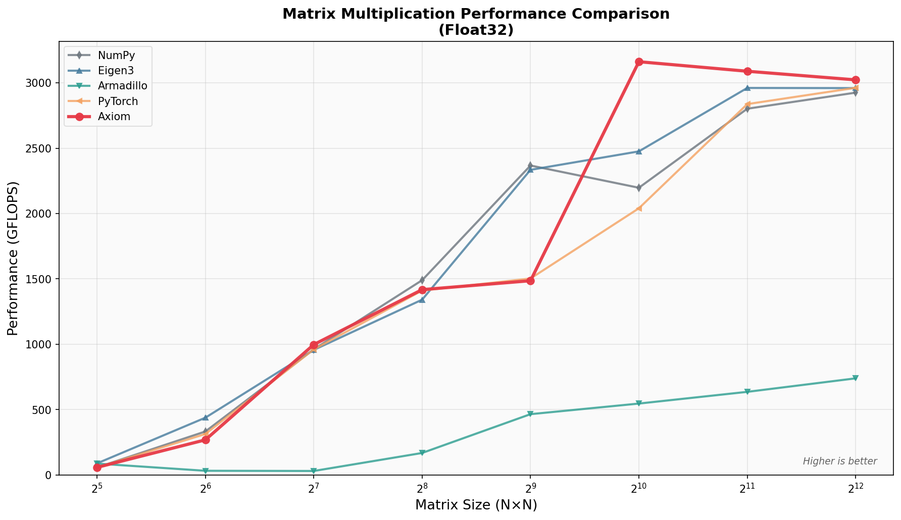
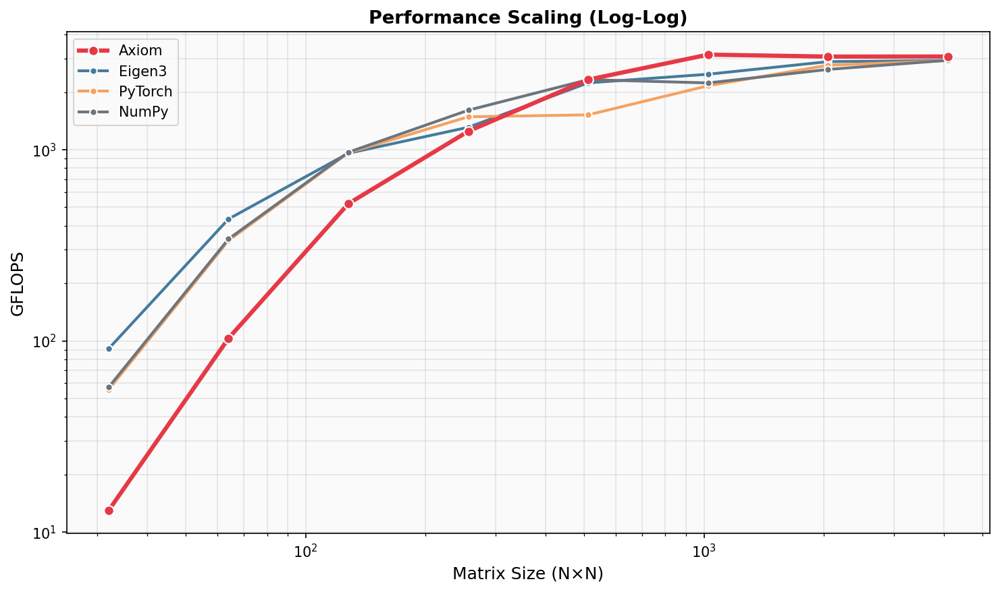
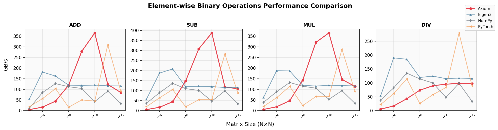
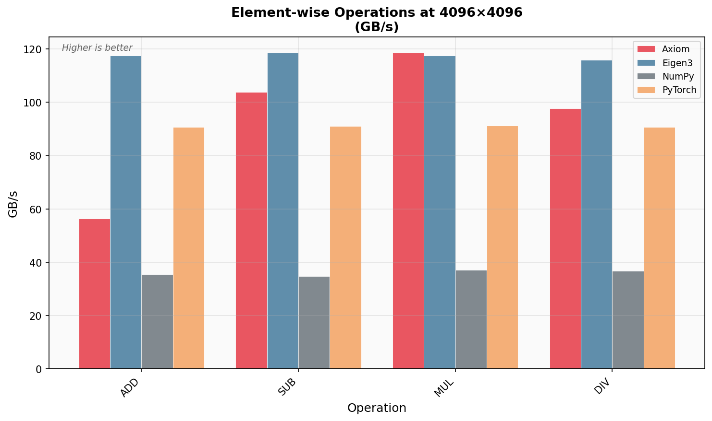
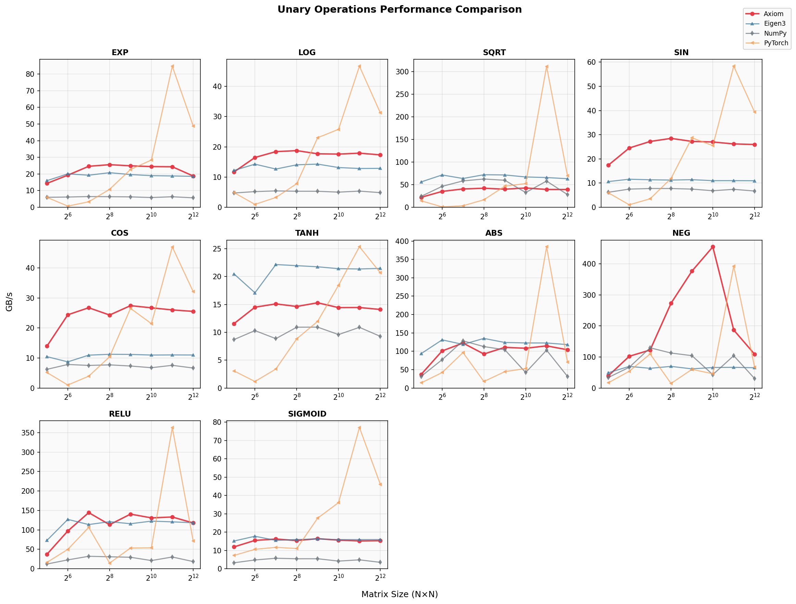
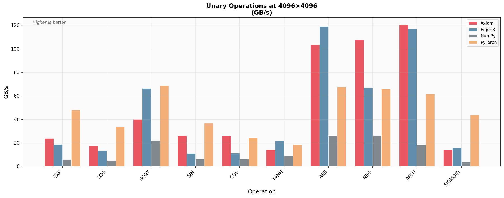
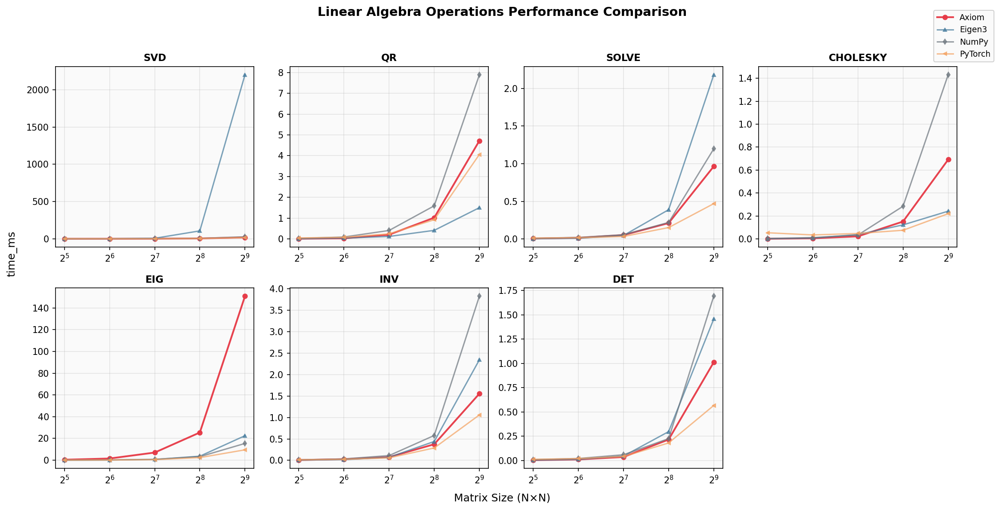
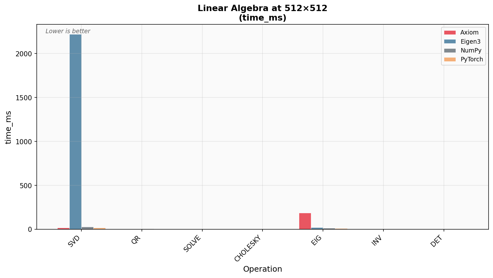

# Axiom Benchmark Results

*Generated: 2026-02-07 00:45*

*Platform: Darwin arm64*

## Contents

- [Summary](#summary)
- [Matrix Multiplication](#matrix-multiplication)
- [Element-wise Operations](#element-wise-operations)
- [Unary Operations](#unary-operations)
- [Linear Algebra](#linear-algebra)
- [FFT Operations](#fft-operations)
- [Fusion Patterns](#fusion-patterns)
- [Test Environment](#test-environment)

---

## Summary

Comprehensive performance comparison across tensor operations.


---

## Matrix Multiplication

Performance comparison for square matrix multiplication (GFLOPS, higher is better).

| Size | Axiom | Eigen3 | PyTorch | NumPy | Armadillo |
|---:|---:|---:|---:|---:|---:|
| 32×32 | 13.0 | 90.9 | 55.6 | 57.2 | 99.6 |
| 64×64 | 103 | 434 | 335 | 341 | 32.4 |
| 128×128 | 522 | 958 | 963 | 970 | 32.3 |
| 256×256 | 1,248 | 1,310 | 1,486 | 1,609 | 167 |
| 512×512 | 2,325 | 2,236 | 1,521 | 2,325 | 389 |
| 1024×1024 | 3,142 | 2,481 | 2,160 | 2,234 | 413 |
| 2048×2048 | 3,069 | 2,887 | 2,765 | 2,628 | 596 |
| 4096×4096 | 3,071 | 2,928 | 2,922 | 2,935 | 630 |

### Performance Comparison



### Scaling Analysis




---

## Element-wise Operations

Binary element-wise operations (add, sub, mul, div) measured in GB/s throughput.

*Results at 4096×4096 (GB/s)*

| Operation | Axiom | Eigen3 | PyTorch | NumPy |
|:---|---:|---:|---:|---:|
| add | 85.1 | 116 | 90.2 | 32.7 |
| sub | 108 | 116 | 87.2 | 33.8 |
| mul | 113 | 116 | 89.6 | 34.0 |
| div | 97.6 | 116 | 88.7 | 33.1 |

### Performance by Operation



### Bar Chart Comparison




---

## Unary Operations

Unary operations (exp, log, sqrt, sin, cos, tanh, abs, neg, relu, sigmoid) measured in GB/s.

*Results at 4096×4096 (GB/s)*

| Operation | Axiom | Eigen3 | PyTorch | NumPy |
|:---|---:|---:|---:|---:|
| exp | 23.1 | 18.5 | 48.0 | 5.61 |
| log | 17.3 | 12.8 | 30.1 | 4.73 |
| sqrt | 39.1 | 63.9 | 61.4 | 24.4 |
| sin | 25.8 | 9.69 | 35.7 | 6.37 |
| cos | 25.4 | 11.0 | 33.8 | 6.28 |
| tanh | 13.9 | 21.3 | 20.5 | 8.79 |
| abs | 98.3 | 115 | 70.1 | 22.5 |
| neg | 101 | 63.9 | 65.9 | 25.1 |
| relu | 110 | 113 | 67.7 | 14.7 |
| sigmoid | 13.7 | 15.8 | 44.9 | 3.22 |

### Performance by Operation



### Bar Chart Comparison




---

## Linear Algebra

Linear algebra operations (SVD, QR, solve, Cholesky, eigendecomposition, inverse, determinant).
Measured in milliseconds (lower is better).

*Results at 512×512 (time_ms)*

| Operation | Axiom | Eigen3 | PyTorch | NumPy |
|:---|---:|---:|---:|---:|
| svd | 19.1 | 2,360 | 16.8 | 29.0 |
| qr | 4.59 | 1.45 | 4.07 | 8.15 |
| solve | 1.01 | 2.19 | 0.50 | 1.24 |
| cholesky | 0.75 | 0.23 | 0.26 | 1.59 |
| eig | 154 | 22.1 | 9.88 | 15.7 |
| inv | 1.52 | 2.37 | 1.07 | 4.04 |
| det | 1.01 | 1.47 | 0.58 | 1.74 |

### Performance by Operation



### Bar Chart Comparison




---

## FFT Operations

Fast Fourier Transform operations (fft, ifft, rfft, fft2, ifft2, rfft2).
Measured in milliseconds (lower is better).

*Results at 2048×2048 (time_ms)*

| Operation | Axiom | PyTorch | NumPy |
|:---|---:|---:|---:|
| fft | 0.10 | 0.01 | 0.01 |
| ifft | 0.08 | 0.01 | 0.01 |
| rfft | 0.08 | 0.01 | 0.01 |
| fft2 | 15.2 | 29.3 | 65.7 |
| ifft2 | 15.3 | 30.3 | 31.8 |
| rfft2 | 11.4 | 8.27 | 25.5 |

### Performance by Operation


### Bar Chart Comparison


---

## Fusion Patterns

Lazy evaluation with operation fusion vs eager mode execution.

*Run `make benchmark-fusion` to generate fusion data.*


---

## Test Environment

```
OS: Darwin 25.2.0
Architecture: arm64
Python: 3.14.2
Timestamp: 2026-02-07T00:43:11.398878
```

## Notes

- All benchmarks run on CPU
- Axiom uses Accelerate framework (BLAS) on macOS
- Higher GFLOPS/GB/s = better for throughput metrics
- Lower ms = better for time metrics
- Results may vary based on system load and thermal conditions
